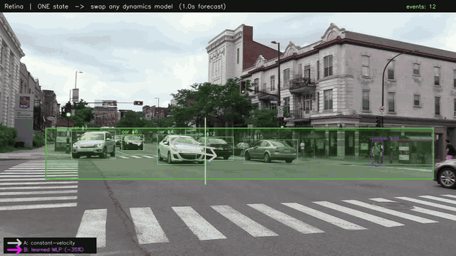

# Retina

[](https://github.com/raullenchai/trio-retina/actions/workflows/ci.yml)
[](LICENSE)



*Any detector → a standard **world-state**: boxes, track ids, a zone, live events —
and a **forecast** arrow per entity (where it's headed, from a dynamics model
reading Retina's state). Detection is YOLO here; swap it for V-JEPA / DINO / a VLM
and nothing downstream changes.*

**The model-agnostic state layer for world models.** Turn raw real-world signals —
video, audio, sensor — into **queryable state**: human-readable **events** *and*
optional machine **latent** vectors, ready for a world model's dynamics.

In world-model terms (**encoder → dynamics → decoder**), Retina is the **encoder
layer** — `s = Enc(x)`. But it doesn't *replace* the foundation encoders; it's
**model-agnostic** and sits *on top* of them. Bring YOLO, V-JEPA, DINO, SAM, a VLM —
whatever — and Retina assembles their output into one coherent, standard,
serializable **world-state**. It doesn't predict the future or pick actions; it
produces the state those layers run on.

```
 foundation encoders (below)      RETINA = the model-agnostic state layer    build on top
 ──────────────────────────   ───────────────────────────────────────   ──────────────────
 YOLO · V-JEPA · DINO · SAM    any model's output  →  STATE               dynamics (predict
 Grounding-DINO · a VLM   →      • events: zone.enter, dwell, …       →   next state) · apps
                                 • latent: per-object & scene vectors       (security/retail)
```

**We don't compete with JEPA / DINO / SAM — we compose them.** The better the
backbones get, the better Retina gets. Think **OpenTelemetry for perception**: it
doesn't build the sensors, it normalizes any of them into one standard state. (And
like Supervision, but a level up — it emits serializable **events**, not just
detections.)

```python
from retina import Retina, Zone, ZoneRule, YoloDetector
from retina.sources import video_frames

dock = Zone("dock", [(0.3, 0.2), (0.7, 0.2), (0.7, 0.9), (0.3, 0.9)], normalized=True)

cam = Retina(
    source_id="cam_01",
    detector=YoloDetector("yolo11n.pt", classes={"person"}),
    rules=[ZoneRule(dock, classes={"person"}, dwell_s=30)],
)
for event in cam.run(video_frames("dock.mp4")):
    print(event.to_json())
    # {"type":"zone.dwell","t":1718254799.8,"src":"cam_01","id":42,
    #  "label":"person","zone":"dock","dur":31.0,"conf":0.91}
```

## Where Retina sits — the encoder of a world model

A world model has three parts: an **encoder** (signals → state), a **dynamics
model** (state + action → next state), and a **policy / decoder** (state → action).
Retina is the **encoder**, and *only* the encoder — an honest, buildable scope. The
dynamics and policy are what you (or Trio's commercial layer) build on top. We say
"encoder," not "world model"; you earn the latter when the dynamics layer ships.

Its output is **dual**, by design — the same entities carried on two linked
channels (the shape object-centric and neuro-symbolic world models converged on):

- **symbolic state** — readable, queryable `events` / entity records (`type`,
  `bbox`, `zone`, `dur`, `track_id`). The model-agnostic standard ([`SPEC.md`](SPEC.md)) —
  for rules, LLM judges, dashboards, audit.
- **latent state** — optional embeddings on the *same* records: a small per-object
  vector (ReID, inline) and a large scene-level vector (V-JEPA, by-reference), each
  model-tagged. For a downstream dynamics model.

Symbols you can read; vectors a model can predict on — never collapsed into one.

**Two senses of "encoder."** The foundation backbones (V-JEPA, DINO, SAM, YOLO) are
encoders that turn pixels into features — that race is theirs, and Retina rides it.
Retina is the encoder *layer* on top: the work that turns those raw, per-frame,
heterogeneous outputs into a state a dynamics model can actually use —

- **fuse** many models into one record (YOLO box + tracker id + V-JEPA scene latent + ReID vector),
- give objects **persistent identity** over time (the precondition for predicting their evolution),
- **structure** it into entities + relations + events (the object-centric shape dynamics models want),
- carry the **dual** symbolic + latent channels, model-tagged,
- as an **event-sourced stream** — exactly the offline data a dynamics model trains on,
- in one small, **serializable, model-agnostic standard**.

## Why Retina

The industrial tools for this (NVIDIA **DeepStream**, **Holoscan**) are powerful
but unloved by the community — heavy *platforms*, not small *libraries*. Retina
keeps their good ideas (the event semantics, the metadata model, the composable
graph) and drops the weight:

| | DeepStream / Holoscan | **Retina** |
|---|---|---|
| Install | CUDA + TensorRT + containers | `pip install retina-sdk` |
| Hardware | NVIDIA GPU / Jetson locked | any machine — CPU is fine |
| Model | tied to the NV stack | **bring any model** (or none) |
| Language | GStreamer/GXF graphs, C++ / `.so` | plain Python |
| Shape | a platform you build *inside* | a library you `import` |
| Core deps | a lot | **numpy** |

## Install

```bash
pip install retina-sdk            # core: numpy only
pip install 'retina-sdk[yolo]'    # + Ultralytics YOLO adapter
pip install 'retina-sdk[video]'   # + OpenCV frame source (files / RTSP / webcam)
pip install 'retina-sdk[all]'
```

## System architecture

Everything flows through one append-only data unit, the **`Frame`**. Each stage
*enriches* it and never overwrites upstream fields (DeepStream's metadata-tree
idea, in plain dataclasses):

```
                      ┌──────────────── Frame (append-only) ───────────────┐
 frame ─► Detector ─► │ .detections ─► Tracker ─► .tracks ─► Rule ─► .events │ ─► Sink
   ▲        ▲         │                  ▲                    ▲              │     ▲
 source   any model   │   Gate (skip?)   tracker     zone/line/count/dwell  │  jsonl/
                      │   Enricher (VLM / V-JEPA → .user)                    │  webhook/kafka
                      └─────────────────────────────────────────────────────┘
```

- A **node** is a tiny step: `Frame -> Frame` (or `None` to drop the frame).
- The **detector** is the model-agnostic seam: any `callable(image) -> [Detection]`.
- The **tracker** gives objects identity over time (precondition for temporal events).
- **Rules** turn tracks into generic **events**; **enrichers** attach context
  (a VLM caption, a V-JEPA novelty score) to `frame.user`; **gates** skip work.
- **Sinks** push events out.

### The output: dual state — symbolic + latent

The encoder emits **two linked channels on the same entities** — the pattern
object-centric and neuro-symbolic world models converged on (a symbol you can read,
a vector a model can predict on; see [Concept Embedding Models], [Slot Attention]):

- **symbolic** — `events` / entity records: `type`, `bbox`, `zone`, `dur`, `track_id`.
  Readable, queryable, the model-agnostic standard. Feeds rules / LLM-judges as JSON.
- **latent** — optional embeddings on the same records: a small per-object vector
  (ReID, **inline**) and a large scene-level vector (V-JEPA, **by-reference**), each
  **model-tagged** (`{model, dim, dtype}`). Feeds a future dynamics model.

Today Retina emits the symbolic stream plus the per-object embedding hook
(`Detection.embedding`); the V-JEPA scene latent rides the enricher seam. Fusion is
the standard two-level recipe: detector+tracker → symbolic core + ReID embedding;
frozen V-JEPA → scene latent (+ optional ROI-pooled per-entity latent).

This is carried by **two tiny standards**:

1. **`retina.event`** — the event/state format ([`SPEC.md`](SPEC.md)). What flows out.
2. **`retina.flow`** — the workflow format (JSON). How models are wired together.

[Concept Embedding Models]: https://arxiv.org/abs/2209.09056
[Slot Attention]: https://arxiv.org/abs/2006.15055

## Pipeline — compose models like n8n / LangChain (no GUI)

Three equivalent ways to wire a pipeline; pick your altitude.

**1. The `|` operator (LCEL-style, recommended):**

```python
from retina import YoloDetector, IoUTracker, ZoneRule, JsonlSink

pipe = YoloDetector("yolo11n.pt") | IoUTracker() | ZoneRule(dock) | JsonlSink("events.jsonl")
for event in pipe.run(video_frames("dock.mp4")):
    ...
```

Add a cheap gate and a VLM enricher anywhere in the chain — the cortex
YOLO+gate+VLM pattern, but composable:

```python
from retina import MotionGate, GateNode, EnricherNode

pipe = (
    GateNode(MotionGate())                 # skip static frames (cut model calls)
    | YoloDetector("yolo11n.pt", classes={"person", "forklift"})
    | IoUTracker()
    | EnricherNode(my_vlm_describe)        # attach a VLM read to frame.user
    | ZoneRule(dock, dwell_s=30)
    | JsonlSink("events.jsonl")
)
```

**2. Explicit node list:**

```python
from retina import Pipeline, DetectorNode, TrackerNode, RuleNode
pipe = Pipeline([DetectorNode(yolo), TrackerNode(), RuleNode(ZoneRule(dock))])
```

**3. Declarative workflow file** (shareable, no code — see `examples/workflow.json`):

```python
pipe = Pipeline.from_json("workflow.json")
pipe.run(video_frames("dock.mp4"))
```

### Node catalog

| node | what it does | wraps |
|---|---|---|
| `DetectorNode` | image → detections | any `callable(image)->[Detection]` |
| `TrackerNode` | detections → tracks | `IoUTracker` / `NorfairTracker` |
| `RuleNode` | tracks → events | `ZoneRule` / `LineRule` / `CountRule` |
| `GateNode` | drop uninteresting frames | any `callable(image,t)->bool` (e.g. `MotionGate`) |
| `EnricherNode` | attach context to `frame.user` | any `callable(frame)->dict` (VLM / V-JEPA) |
| `SinkNode` | emit events | `JsonlSink` / `WebhookSink` |

Register your own node type for `from_json` with `register_node("my_type", builder)`.

## Models supported (the bottom layer)

Retina imports no model — **any** `callable(image) -> [Detection]` plugs in
(`CallableDetector` wraps a function in one line). Batteries-included adapters:

- **YOLO family** — `YoloDetector("<weights>.pt")` via Ultralytics: YOLOv5/8/9/10/11/12,
  RT-DETR. Swap models = swap the weights string. Open-vocab via YOLO-World:
  `YoloDetector("yolov8s-world.pt", vocab=["forklift", "pallet"])`.
- **Open-vocab from text** — `GroundingDinoDetector(["forklift", "hard hat"])`
  (`pip install 'retina-sdk[grounding]'`), detect any named class, no training.
- **Any VLM** — `VlmDetector(client, prompt)`: you pass a `client(image, prompt)`
  that returns boxes (Qwen-VL / Gemini / GPT-4o / Claude / local), Retina maps it
  to events. A VLM can plug in two ways: as a **detector** (per-frame boxes →
  events) or as an **enricher / event source** (`EnricherNode`, emit context /
  semantic events directly).

Trackers are pluggable too: `IoUTracker` (pure-Python default) or
`NorfairTracker` (`pip install 'retina-sdk[norfair]'`, Kalman + re-association).

## The Event schema — tiny, like a JWT

Smallest valid event is three fields; everything else is optional and omitted
when absent. Full format in [`SPEC.md`](SPEC.md).

```json
{"type": "line.cross", "t": 1718254799.8, "src": "cam_01"}
```

```json
{"type":"zone.dwell","t":1718254799.8,"src":"cam_01","id":42,
 "label":"person","zone":"dock","dur":31.0,"conf":0.91}
```

Need a custom field? Just add a key (namespace it): `"acme.shift": "night"`.

Validate events against the standard (pure-Python, no extra deps); the formal
JSON Schema ships as [`retina/event.schema.json`](retina/event.schema.json):

```python
from retina import validate, is_valid
validate(event)   # -> [] if valid, else a list of problems
```

## Demos (no model, no GPU)

```bash
python examples/quickstart.py        # zone / line / count / dwell events
python examples/three_apps.py        # app-agnostic: one stream -> security, retail, safety
python examples/any_model.py         # model-agnostic: swap the detector, rest unchanged
python examples/gate_savings.py      # efficiency: a cheap gate cuts detector calls 100 -> 23
python examples/pipeline_compose.py  # compose with | (the "n8n without a GUI" demo)
python examples/yolo_video.py v.mp4  # real footage  (pip install 'retina-sdk[all]')
python examples/autotune.py v.mp4    # AUTO-TUNE a pipeline from oracle labels (below)
```

### AutoResearch: auto-tune a pipeline from a few oracle labels

`examples/autotune.py` is the headline: point a strong/expensive model (or a
frontier VLM / Opus on a few sampled clips) at the **train** part of a video to
get reference events, then automatically search a cheap pipeline's params
(detector confidence, tracker IoU/min-hits, frame stride) to reproduce them —
scored by `retina.event_f1`. On a real fixed-cam intersection video, a tiny
YOLO11n pipeline auto-tuned against a ~10× bigger YOLO11l oracle reproduces its
vehicle-crossing events at **F1=1.0 on held-out test footage**, and writes a
ready-to-run `tuned_workflow.json`. That's the arbitrage, automated — and the
engine behind "build your own pipeline for a new scene from sparse labels."

`examples/autotune_oracle.py` runs the same loop with a **frontier model as the
sparse teacher** (here Opus hand-labeled people-in-zone on 5 frames of a fixed
street cam — a *customer-flow / restricted-zone* B2B task). Autotune searched the
cheap YOLO11n pipeline's confidence, input resolution, and min box size to
reproduce those counts, cutting count error on **held-out** frames from MAE 3.5
to 1.25 — and it picked a non-obvious knob (input resolution) on its own. Swap
the hand labels for a VLM API call to scale the teacher.

## Status / roadmap

Early but real (`v0.0.3`). Stable: the event layer + JSON Schema/validator, the
composable pipeline (`|` / list / JSON), YOLO + open-vocab (YOLO-World,
Grounding-DINO) + VLM detectors, IoU + Norfair trackers. Next: ByteTrack/OC-SORT,
`proximity`/`anomaly` primitives, VLM-as-event-source (constrained decode),
Kafka/MQTT sinks. Plus the **latent channel** (surface the V-JEPA scene vector +
per-object embeddings in the state). The distillation/arbitrage engine (frontier
model → small edge model) is deliberately **not** here — that's the commercial
layer; Retina only exposes the `detector` and `gate` seams it plugs into.

The next rung up the world-model stack is the **dynamics model** (state + action →
next state): predict how the operation evolves, run what-ifs. That's a separate
product built *on* Retina's state — not part of the encoder. Encoder now; world
model when the dynamics layer earns the name.

## Where Retina fits

Retina is the open **perception encoder** (Signal → State) extracted from
[Trio](https://machinefi.com). The layers above — the dynamics model, and policy /
judgment / domain experts (State → Judgment → Action) — are Trio's commercial
platform. Retina is, and stays, model-agnostic and free.

## License

Apache-2.0.
