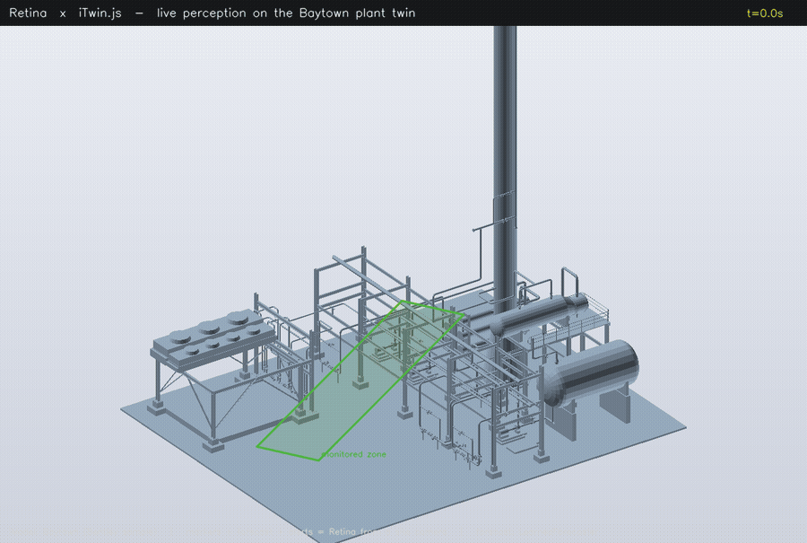

# Retina × iTwin.js — a live, predictive perception layer for your digital twin

> **The story.** [iTwin.js](https://www.itwinjs.org/) models the *asset* — the
> geometry and engineering data of a road, plant, or campus. What it doesn't have
> is **what's happening in that asset right now**: the people, vehicles, and
> equipment, where they are, and where they're headed. Retina supplies exactly
> that — it turns any site camera into a structured, semantic **world-state +
> event stream**, and this example drops it straight onto an iModel.
>
> Retina is **not** a digital twin and does not compete with iTwin. It's the
> missing *live eyes*: the layer that makes a static, as-built twin a **living,
> predictive** one — connected through one neutral, model-agnostic event contract.



*Real Bentley **Baytown** sample iModel. Every marker, forecast arrow, and
`retina.event` alert is produced by Retina from a site camera and dropped onto the
twin through one JSON contract — rendered fully headless (no GPU). The interactive
version is [`viewer/src/RetinaDecorator.ts`](./viewer/src/RetinaDecorator.ts).*

```
 site camera ─▶ Retina pipeline ─────────────▶ retina_events.json ─▶ RetinaDecorator ─▶ iTwin viewer
 (any model)   detect│track│zone│rule│forecast   (retina.event std)    (this example)     (the iModel)
```

The seam is a **file**, not an API lock-in: the Python side emits the
`retina.event` standard; the TypeScript side consumes only that. Swap the camera,
the detector (YOLO → V-JEPA → a domain model), or the twin — the contract in the
middle doesn't move.

## What you see on the twin

- **Live entities** — every detected car / truck / person becomes a marker on the
  iModel ground plane, coloured by type, labelled with its track id, hover for a
  live tooltip.
- **The predictive layer** — each entity draws a **forecast arrow** (Retina's
  dynamics model, ~1 s ahead). The twin shows not just *where things are* but
  *where they're going* — congestion, a person heading into a restricted zone.
- **Events as alerts** — `zone.enter`, `line.cross`, `count.threshold` from
  Retina surface as twin alerts in real time (146 zone-enters, 9 line-crossings,
  … in the bundled clip).
- **A calibrated zone** — the road zone, drawn from the same camera→world
  calibration, anchors everything to the model's coordinates.

## The two pieces

| File | Side | Role |
|------|------|------|
| [`export_events.py`](./export_events.py) | Python (Retina) | Runs the traffic pipeline + forecaster on a video, writes `retina_events.json`. |
| [`viewer/src/RetinaDecorator.ts`](./viewer/src/RetinaDecorator.ts) | TypeScript (iTwin.js) | One `Decorator` that replays the stream as markers + forecast arrows + event alerts on any iModel. Depends only on `@itwin/core-frontend`. |

`retina_events.json` is **committed** — the viewer runs with no Python, no model,
no GPU. Regenerate it from any clip:

```bash
# from the repo root, in an env with retina + ultralytics + torch
python examples/itwin/export_events.py /path/to/site.mp4 examples/itwin/retina_events.json
```

## Coordinates — the one thing you calibrate per camera

Each entity carries a `world` ground-plane point in metres. Retina computes it
with a **one-time camera→world homography** (4 reference points — the road-zone
corners → a metric rectangle; see `homography()` in `export_events.py`). This is
the standard per-camera calibration you already do for any site analytics; it is
**not** per-frame and **not** ML.

`RetinaDecorator`'s `Placement { origin, scale, yaw }` then drops that metric
frame onto a specific iModel's spatial extents — the only knob you tune to line
the road up with the model. Honest scope: the demo hard-codes the calibration;
production would expose it as a small per-camera setup step.

## Run it

See [`viewer/README.md`](./viewer/README.md) for the iTwin Viewer setup (local
snapshot iModel, no cloud auth) and how `RetinaDecorator` is registered.

## Why this matters for an iTwin shop

- **Pure complement, zero overlap.** iTwin owns the asset + coordinates +
  visualization; Retina owns the live, semantic, multi-camera occupancy + events
  + prediction. No competition for the same surface.
- **Beats point sensors.** An IoT temperature/vibration tag can't tell you "the
  person in orange is walking toward crane #3." Vision-derived semantic entities
  + forecast can.
- **One neutral contract.** `retina.event` is the wire format into the twin —
  decoupled from which camera or model produced it. "OpenTelemetry for
  perception," landing in iTwin.
- **Predictive twin.** The forecast layer is what turns "digital twin" into the
  "AI-based digital twin" everyone is chasing — and Retina supplies the
  world-state that makes it predictive.
